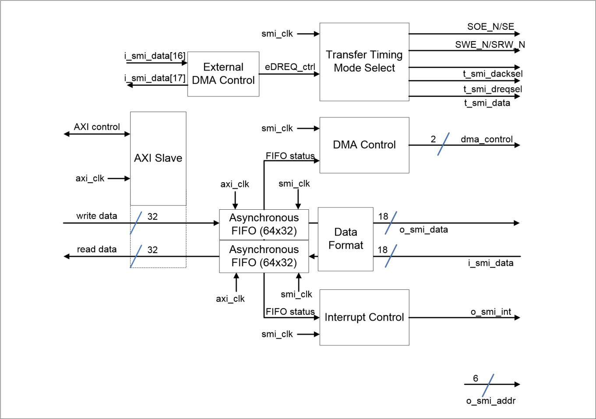

## Secondary Memory Interface
This document contains information relevant to the SMI hardware. 

The SMI is intended for use with devices that might otherwise slow down or interfere with system operations if they were connected directly to the system bus.

SMI supports:
<ul>
    <li> 8, 9, 16, 18-bit register based devices
    <li> Both RD/WR and Enable/Direction style devices (Mode80 & Mode68)
    <li> MIPI DBI and Nokia MeSSI standard devices
    <li> Use of small and large paged multiplexed NAND devices
    <li> Minimises performance impact of connecting slow devices to the main system bus
    <li> Precise SMI bus timings
</ul>

### SMI Architecture

The SMI hardware is made up of three state machines: output timing to the external device, interfacing to the AXI bus and external DREQ handling. The state machine surround two 256-byte asynchronous FIFOs, split into 64x32-bit word entries, handling read and write transfers to the device.

When writing to an external device data is written to the write FIFO from the AXI slave, clocked by the AXI clock, and read out by the device, clocked by the SMI clock.

When reading from an external device the device writes to the read FIFO, clocked by the SMI clock, and the AXI slave reads out data, clocked by the AXI clock.

There are also additional blocks to control interrupts and the DMA. External DMA requests may be passed through the SMI using the top two bits of the data bus.

### Output Data Modes
The SMI can interface with 8, 9, 16 and 18-bit register devices. Data may be written to the FIFO in 16-bit RGB565 format or 32-bit XRGB8888 format. To enable pixel modes, PXLDAT must be set to 1. The format used is specified by WFORMAT in the relevant SMI_DSW register. A values bit ordering can be reversed using WSWAP. Data must be unpacked after reading from the RX FIFO with the required reads being equal to the number of FIFO entries for a given interface width and pixel format. The SMI_L register always relates to the number of physical transfers. Example: A transfer of 32-bits total volume using and 8-bit interface and RGB565 pixel format would require the SMI_L value to be 4 and the RX FIFO to be read once.

#### 8-bit Interface

### Register Map
| Offset | Register Name | Description                   | Size |
| ------ | ------------- | ----------------------------- | ---- |
| 0x00   | SMI_CS        | SMI Control and Status        | 32   |
| 0x04   | SMI_L         | SMI Length                    | 32   |
| 0x08   | SMI_A         | SMI Address                   | 32   |
| 0x0C   | SMI_D         | SMI Data                      | 32   |
| 0x10   | SMI_DSR0      | SMI Device Read Settings 0    | 32   |
| 0x14   | SMI_DSRW0     | SMI Device Write Settings 0   | 32   |
| 0x18   | SMI_DSR1      | SMI Device Read Settings 1    | 32   |
| 0x1C   | SMI_DSRW1     | SMI Device Write Settings 1   | 32   |
| 0x20   | SMI_DSR2      | SMI Device Read Settings 2    | 32   |
| 0x24   | SMI_DSRW2     | SMI Device Write Settings 2   | 32   |
| 0x28   | SMI_DSR3      | SMI Device Read Settings 3    | 32   |
| 0x2C   | SMI_DSRW3     | SMI Device Write Settings 3   | 32   |
| 0x30   | SMI_DC        | SMI DMA Control               | 32   |
| 0x34   | SMI_DCS       | SMI Direct Control and Status | 32   |
| 0x38   | SMI_DA        | SMI Direct Address            | 32   |
| 0x3C   | SMI_DD        | SMI Direct Data               | 32   |
| 0x40   | SMI_FD        | SMI FIFO Debug                | 32   |

#### Control & Status Register
The status and control register controls non-direct transfers and monitors peripheral status.

| Field  | Description                                                                                                                                                                                                                                                                                                                                    | Access |
| ------ | ---------------------------------------------------------------------------------------------------------------------------------------------------------------------------------------------------------------------------------------------------------------------------------------------------------------------------------------------- | ------ |
| ENABLE | Enable the SMI. Value is OR'd with the DCS register. When disabled, the SMI enters low power mode, however R/W access is still available                                                                                                                                                                                                       | R/W    |
| DONE   | Current transfer status. Set when the final word has been recieved or written for a given transfer                                                                                                                                                                                                                                             | R/W    |
| ACTIVE | Indicates the current transfer status                                                                                                                                                                                                                                                                                                          | R      |
| START  | Start Transfer. Auto clearing bit and will always be read as 0, writing 1 while active has no effect                                                                                                                                                                                                                                           | W      |
| CLEAR  | Clear the FIFOs. FIFOs will be reset to the empty state. Auto clearing bit and will always be read as 0                                                                                                                                                                                                                                        | W      |
| WRITE  | Set the transfer direction. 0 = Read ; 1 = Write                                                                                                                                                                                                                                                                                               | R/W    |
| PAD    | Padding Words. The number of FIFO words to be discarded at the start of a transfer. For writes, value indicates the number of words that will be taken from the TX FIFO but not transferred. For reads, value indicate number of words that will be received from the peripheral, after packing, but will not be writted into the RX FIFO. 0-4 | R/W    |
| TEEN   | Tear Effect Mode. Programmed transfers will wait for a Tear Effect trigger before starting                                                                                                                                                                                                                                                     | R/W    |
| INTD   | Interrupt while DONE = 1                                                                                                                                                                                                                                                                                                                       | R/W    |
| INTT   | Interrupt while TXW = 1                                                                                                                                                                                                                                                                                                                        | R/W    |
| INTR   | Interrupt while RXR = 1                                                                                                                                                                                                                                                                                                                        | R/W    |
| PVMODE | Pixel Value Mode. Transmit data is taken from the pixel value interface rather than the AXI input.                                                                                                                                                                                                                                             |        |
| SETERR | Setup error has occured. Setup registers were written to when enabled. Can be cleared by writing 1                                                                                                                                                                                                                                             | R/W    |
| PXLDAT | Enable pixel formatting modes. Data in the FIFO's will be packed to match the pixel format selected                                                                                                                                                                                                                                            | R/W    |
| EDREQ  | External DREQ received. Indicates the status of the external devices DREQ when in DMAP mode                                                                                                                                                                                                                                                    | R      |
| PRDY   | Appear not ready on the AXI bus if the appropriate FIFO is not ready. SMI will stall the AXI bus when reading or writing data to SMI_D unless there is room in the FIFO for writes or data available for a read. AXI may become locked or seriously impact system performance                                                                  | R/W    |
| AFERR  | AXI FIFO error has occured. Either a read of the RFIFO when empty or a write of the WFIFO when full. Can be cleared by writing 1                                                                                                                                                                                                               | R/W    |
| TXW    | TX FIFO need writing. 0 = TX FIFO is at least 1/4 full or the transfer direction is set to READ. 1 = TX FIFO is less than 1/4 full and the transfer direction is set to WRITE                                                                                                                                                                  | R      |
| RXR    | RX FIFO needs reading. 0 = RX FIFO is less than 3/4 full or when DONE and FIFO no empty. 1 = RX FIFO is at least 3/4 full or the transfer has finished and the FIFO still need reading. Transfer direction must be set to READ                                                                                                                 | R      |
| RXD    | TX FIFO can accept data. 0 = TX FIFO is cannot accept new data or the transfer direction is set to READ. 1 = TX FIFO can accept at least 1 word of data and the transfer direction is set to WRITE                                                                                                                                             | R      |
| RXD    | RX FIFO contains data. 0 = RX FIFO contains no data or the transfer direction is set to WRITE. 1 = RX FIFO contains at least 1 word of data that can be read and the transfer direction is set to READ                                                                                                                                         | R      |
| TXE    | .                                                                                                                                                                                                                                                                                                                              | R      |
| RXF    | RX transfer has not filled length contract.                                                                                                                                                                                                                                                                                                                               | R      |

#### SMI Transfer length Register
The SMI length register is used to specify the number of transfers on the SMI bus in words. The word width is configured by the DSR & DSW registers. During a transfer the register reads as the number of words transferred so far.

| Field  | Width | Description                                                                                                                                | Access | Reset      |
| ------ | ----- | ------------------------------------------------------------------------------------------------------------------------------------------ | ------ | ---------- |
| Length | 31:0  | Write: Sets the number of words to transfer over the external bus. Read: During a transfer contains the number of words transferred so far | R/W    | 0x00000000 |

#### SMI Address Register Defintion
The SMI address register is used to specify the address for a given transfer. Device settings can be selected using this register.

| Field  | Width | Description                                                         | Access | Reset |
| ------ | ----- | ------------------------------------------------------------------- | ------ | ----- |
| _X     | 31:10 |                                                                     |        |       |
| DEVICE | 9:8   | Which set of device settings should be used for this transfer (0-4) | R/W    | 0x0   |
| _X     | 7:6   |                                                                     |        |       |
| ADDR   | 5:0   | Address to be used for transfers and presented on the SMI bus       | R/W    | 0x00  |

#### SMI Data Register
The SMI data register is used to interface with the transmit FIFOs. Data written to the SMI_D register is placed in the transmit FIFO. Data read from the SMI_D register is taken from the receive FIFO.

| Field | Width | Description                                                                  | Access | Reset      |
| ----- | ----- | ---------------------------------------------------------------------------- | ------ | ---------- |
| DATA  | 31:0  | Reading returns the top value of RX FIFO. Writing writes to back of TX FIFO. | R/W    | 0x00000000 |

#### SMI DMA Control Register
The SMI DMA control register is used to control the behaviour of the DMA DREQ and PANIC signals on the AXI bus. The SMI can generate TX and RX DREQ to control an external AXI DMA controller. It can also generate PANIC signals on user configurable FIFO level threshold values.

| Field  | Width | Description                                                                                                                                                                                                                                                                                                                                   | Access | Reset |
| ------ | ----- | --------------------------------------------------------------------------------------------------------------------------------------------------------------------------------------------------------------------------------------------------------------------------------------------------------------------------------------------- | ------ | ----- |
| _X     | 31:29 |                                                                                                                                                                                                                                                                                                                                               |        |       |
| DMAEN  | 28    | DMA Enable. Enables the DREQ and PANIC signals to control the AXI bus DMA transfers. 0 = No DREQ or PANIC will be issued ; 1 = DREQ and PANIC will be generated when the FIFO levels reach the programmed levels                                                                                                                              | R/W    | 0     |
| _X     | 27:25 |                                                                                                                                                                                                                                                                                                                                               |        |       |
| DMAP   | 24    | External DREQ Mode. Top 2 bits of the SMI data bus are used as DREQ and DREQ_ACK signals that can be used to pace the flow of data on the external SMI bus. Separate from normal AXI DMA behaviour. Must be used in conjunction with RDREQ or WRREQ. 0 = Top two pins used as SMI data ; 1 = Top two data pins used for external DMA requests | R/W    | 0     |
| PANICR | 23:18 | RX Panic Threshold Level. An RX PANIC will be generated when the RX FIFO exceeds this threshold level. Instructs the AXI RX DMA to increase the priority of its bus requests.                                                                                                                                                                 | R/W    | 0x30  |
| PANICW | 17:12 | TX Panic Threshold Level. A TX PANIC will be generated when the TX FIFO falls below this threshold level. Instructs the AXI TX DMA to increase the priority of its bus reequests.                                                                                                                                                             | R/W    | 0x10  |
| REQR   | 11:6  | RX DREQ Threshold Level. An RX DREQ will be generated when the RX FIFO exceeds this threshold level. Instructs an AXI RX DMA to read the RX FIFO. If the DMA is set to perform burst reads, the threshold must ensure that there is sufficient data in the FIFO to satisfy the burst.                                                         | R/W    | 0x20  |
| REQW   | 5:0   | TX DREQ Threshold Level. A TX DREQ will be generated when the TX FIFO falls below this threshold level. Instructs an AXI TX DMA to write more data to the TX FIFO.                                                                                                                                                                            | R/W    | 0x20  |

#### SMI Device Read Settings Register
The SMI Device Read Settings register is used to configure the timings and bus configuration used for reads of an external device. 4 Device settings registers are available, allowing 3 different configurations to be specified. The read device is selected in the Address register.

| Field    | Width | Description                                                                                                                                                                                                                                                                                                                         | Access | Reset |
| -------- | ----- | ----------------------------------------------------------------------------------------------------------------------------------------------------------------------------------------------------------------------------------------------------------------------------------------------------------------------------------- | ------ | ----- |
| RWIDTH   | 31:30 | Read Transfer Width. 00 = 8-bit ; 01 = 16-bit ; 10 = 18-bit; 11 = 9-bit.                                                                                                                                                                                                                                                            | R/W    | 0     |
| RSETUP   | 29:24 | Duration between chip select being asserted and read strobe going active. Measured in SMI bus clock cycles [1-64]                                                                                                                                                                                                                   | R/W    | 0x01  |
| MODE68   | 23    | System-x Bus Operation. Specify the operation mode of the external bus. 0 = System-80 ; 1 = System-68                                                                                                                                                                                                                               | R/W    | 0     |
| FSETUP   | 22    | Setup Time Multiplicity. Specify wether to apply setup time to each transfer. 0 = Always apply setup time ; 1 = Setup time only applied to the first transfer after de-assertion of chip select.                                                                                                                                    | R/W    | 0     |
| RHOLD    | 21:16 | Read Strobe Hold Duration. Duration between read strobe going inactive and chip select de-asserting. Measure in SMI bus clock cycles [1-64]                                                                                                                                                                                         | R/W    | 0x01  |
| RPACEALL | 15    | Pace Time Multiplicity. Specify wether to apply pace time to each transfer. 0 = Only apply to access through the same device settings ; 1 = Apply to next access regardless of device settings used                                                                                                                                 | R/W    | 0     |
| RPACE    | 14:8  | Duration between chip select de-asserting and any other transfer being allowed on the bus. Measured in SMI bus clock cycles [1-128]                                                                                                                                                                                                 | R/W    | 0x00  |
| RDREQ    | 7     | External Read DREQ. The top 2 bits of the SMI data bus are used as DREQ (SD[16]) and DREQ_ACK (SD[17]) to pace the reads. Must be used in conjunction with DMAP in SMI_CS. 0 = Don't use external DMA requests, reads always happen ; 1 = Use external DMA request to pace device reads, only happen for each DREQ, DREQ_ACK cycle. | R/W    | 0     |
| RSTROBE  | 6:0   | Read Strobe Duration. Duration that the read strobe should be active. Measured in SMI bus clock cycles [1-128]                                                                                                                                                                                                                      | R/W    | 0x0C  |

#### SMI Device Write Settings Register
The SMI Device Write Settings register is used to configure the timings and bus configuration used for writes to an external device. 4 Device settings registers are available, allowing 3 different configurations to be secificed. The write device is selected in the Address register.

| Field    | Width | Description                                                                                                                                                                                                                                                                                                                            | Access | Reset |
| -------- | ----- | -------------------------------------------------------------------------------------------------------------------------------------------------------------------------------------------------------------------------------------------------------------------------------------------------------------------------------------- | ------ | ----- |
| WWIDTH   | 31:30 | Write Transfer Width. 00 = 8-bit ; 01 = 16-bit ; 10 = 18-bit; 11 = 9-bit                                                                                                                                                                                                                                                               | R/W    | 0     |
| WSETUP   | 29:24 | Duration between chip select being asserted and write strobe going active. Measured in SMI bus clock cycles [1-64]                                                                                                                                                                                                                     | R/W    | 0x01  |
| WFORMAT  | 23    | Input Pixel Format. Specifies the packing method used when data is packed. 0 = 16-bit RGB565 ; 1 = 32-bit RGBX8888                                                                                                                                                                                                                     | R/W    | 0     |
| WSWAP    | 22    | Swap Modes. Specifies if word read bit order is swapped. 0 = Pixel data bits not swapped ; 1 = Pixel data bits swapped                                                                                                                                                                                                                 | R/W    | 0     |
| WHOLD    | 21:16 | Read Strobe Hold Duration. Duration between write strobe going inactive and chip select de-asserting. Measured in SMI bus clock cycles [1-64]                                                                                                                                                                                          | R/W    | 0x01  |
| RPACEALL | 15    | Pace Time Multiplicity. Specify wether to apply pace time to each transfer. 0 = Only apply to access through the same device settings ; 1 = Apply to next access regardless of device settings used                                                                                                                                    | R/W    | 0     |
| WPACE    | 14-8  | Duration between chip select de-asserting and any other transfer being allowed on the bus. Measured in SMI bus clock cycles [1-128]                                                                                                                                                                                                    | R/W    | 0     |
| WDREQ    | 7     | External Write DREQ. The top 2 bits of the SMI data bus are used as DREQ (SD[16]) and DREQ_ACK (SD[17]) to pace the writes. Must be used in conjunction with DMAP in SMI_CS. 0 = Don't use external DMA request, writes always happen ; 1 = Use external DMA request to pace device writes, only happen for each DREQ, DREQ_ACK cycle. | R/W    | 0     |
| WSTROBE  | 6-0   | Write Strobe Duration. Duration that the write strobe should be active. Measured in SMI bus clock cycles [1-128]                                                                                                                                                                                                                       | R/W    | 0x0C  |

#### SMI Direct Control and Status Register
The SMI Direct Control and Status register is ued to control direct mode transfers. A direct write will be scheduled even if a normal data transfer is taking place.

| Field  | Width | Description                                                                                                                                                                                                                                                                                           | Access | Reset |
| ------ | ----- | ----------------------------------------------------------------------------------------------------------------------------------------------------------------------------------------------------------------------------------------------------------------------------------------------------- | ------ | ----- |
| _X     | 31:4  |                                                                                                                                                                                                                                                                                                       |        |       |
| WRITE  | 3     | Transfer Direction. 0 = Transfers will read from external devices ; 1 = Transfers will read from external devices                                                                                                                                                                                     | R/W    | 0     |
| DONE   | 2     | Direct Transfer Complete. 0 = No meaning ; 1 = A transfer has finished. Writing 1 to this bit will clear this flag                                                                                                                                                                                    | R/W    | 0     |
| START  | 1     | Start Transfer. 0 = No effect ; 1 = Writing a 1 to this bit will start a transfer if one is not already taking place                                                                                                                                                                                  | W      | 0     |
| ENABLE | 0     | Enable the SMI. This bit is OR'd with the ENABLE bit in the SMI_CS register. If either bit is set then the SMI is enabled. 0 = SMI is disabled and is placed into in a power-saving state with minimal clocking, however the SMI control registers can still be read and written ; 1 = Enable the SMI | R/W    | 0     |

#### SMI Direct Mode Address Register
The Direct Mode Address registr is used to specify the address presented on the external pins when a Direct Mode transfer takes palce. The device settings used is also selected. The register should be written with the address and device settings before the directt mode transfer is placed.

| Field  | Width | Description                                                                                                                   | Access | Reset |
| ------ | ----- | ----------------------------------------------------------------------------------------------------------------------------- | ------ | ----- |
| _X     | 31:10 |                                                                                                                               |        |       |
| DEVICE | 9:8   | Device Settings Selection. 00 = Device settings 0 ; 01 = Device settings 1 ; 10 = Device settings 2 ; 11 = Device settings 3. | R/W    | 0x0   |
| _X     | 7:6   |                                                                                                                               |        |       |
| ADDR   | 5:0   | Address to be used for direct mode transfers                                                                                  | R/W    | 0x00  |

#### SMI Direct Mode Data Register
The Direct Mode Data register is used to read/write the data for a Direct Mode transfer. Write data must be written here before the Direct mode write is started. Read data is valid once the read has completed as indicated by the DONE bit in the SMI_DCS register.

| Field | Width | Description                                                                                                                                   | Access | Reset |
| ----- | ----- | --------------------------------------------------------------------------------------------------------------------------------------------- | ------ | ----- |
| _X    | 31:18 |                                                                                                                                               |        |       |
| DATA  | 17:0  | Reading returns data that has been read from external devices. Writing is used to provide the data that should be written to external devices | R/W    | 0     |

#### SMI FIFO Debug Register
The SMI FIFO Debug register is used to show FIFO status for debug use

| Field | Width | Description                                                                                                                                          | Access | Reset |
| ----- | ----- | ---------------------------------------------------------------------------------------------------------------------------------------------------- | ------ | ----- |
| _X    | 31:14 |                                                                                                                                                      |        |       |
| FLVL  | 13:8  | FIFO High Count Level. Displays the maximum FCNT level reached during the last set of transfers. Reset at the start of each new transfer.            | R/W    | 0     |
| _X    | 7:6   |                                                                                                                                                      |        |       |
| FCNT  | 5:0   | FIFO Count. Displays the FIFO fill leevl of the currently active FIFO. if doing a write transfer then it will indicate the TX FIFO, else the RX FIFO | R/W    | 0     |
